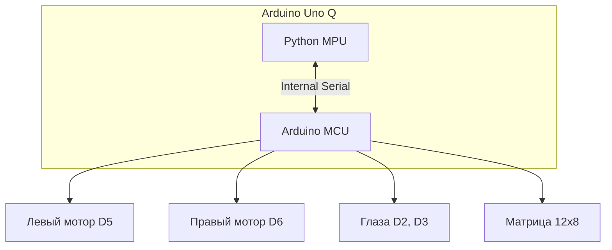

# Как я собрал робота с характером на базе Gemini API и Arduino Uno Q (и научил его подмигивать)

Привет, Хабр!

Вы когда-нибудь мечтали о роботе, который не просто выполняет команды «едь прямо» или «поверни налево», а может обидеться на вас за глупый вопрос или радостно подмигнуть, увидев кота? Я тоже. И решил, что хватит мечтать — пора собирать.

В этой статье я расскажу, как за пару вечеров собрал "гипер-интерактивного" робота, используя **Arduino Uno Q**, немного Python-магии и **Google Gemini Robotics API**. У него нет рук, нет ног, но есть колеса, матричное лицо и, самое главное, — характер.

<cut/>

## Идея: "Мозг" и "Мышцы"

Главная проблема DIY-роботов — вычислительная мощность. Обычно приходится выбирать между Arduino (хорошо крутит моторами) и Raspberry Pi (умеет думать). Но **Arduino Uno Q** меняет правила игры. Она объединяет в себе и то, и другое:

1.  **MPU (Main Processing Unit)**: Мощный "мозг" на Python, который видит, слышит и общается с LLM (Large Language Model).
2.  **MCU (Microcontroller Unit)**: "Мышцы" (C++), которые дергают сервоприводами, светят светодиодами и следят за датчиками.

## Железо: Из чего же сделаны наши мальчишки?

Сборка получилась максимально доступной (ну, почти):

-   **Arduino Uno Q **: Звезда шоу. Встроенная LED-матрица 12x8 — это киллер-фича для создания "лица" робота без лишних проводов.
-   **Шасси**: Классическая двухколесная платформа (differential drive).
-   **Сервоприводы**: 2 штуки постоянного вращения (Continuous Rotation).
-   **Глаза**: 2 красных светодиода (потому что робот должен выглядеть немного зловеще, правда?). Подключены к пинам 2 и 3.
-   **Сенсоры**: Аналоговый датчик расстояния (чтобы не врезаться в стены, пока мечтает о захвате мира).
-   **Периферия**: USB-вебкамера, микрофон и колонка (подключены к "мозгу").

Схема подключения проста как пробка:



## Софт: Оживляем Франкенштейна

### 1. Arduino (C++)

Код для микроконтроллера занимается тем, что парсит команды от Python и управляет железом. Самое интересное тут — это **эмоции**.

Благодаря библиотеке `Arduino_LED_Matrix`, мы можем рисовать на встроенной матрице R4. Я определил несколько "кадров" для эмоций:

-   Neutral (Спокойствие)
-   Happy (Счастье)
-   Sad (Грусть)
-   Angry (Гнев — любимая эмоция моего робота)
-   Surprised (Удивление)

Команда от Python приходит в формате: `L90;R90;E1;Y11`.

-   `L/R`: Скорость моторов (90 — стоп).
-   `E`: ID эмоции.
-   `Y`: Состояние глаз (11 — оба горят, 10 — левый горит, и т.д.).

### 2. Python (MPU)

Этот код выполняется на MPU части платы. Мы используем **Google Gemini Robotics ER 1.5 Preview**. Это не просто чат-бот, это мультимодальная модель, которая может "видеть" картинки и понимать контекст.

Самое важное — это **System Prompt**. Мы должны объяснить модели, кто она такая и как управлять своим телом.

```python
self.system_prompt = """
You are a robot assistant with two wheels and NO arms.
You have an LED matrix for a face and two extra LEDs for eyes.
You must respond in valid JSON format ONLY.
The JSON schema is:
{
    "speech": "text to speak",
    "left_motor": int (-100 to 100),
    "right_motor": int (-100 to 100),
    "emotion": "neutral" | "happy" | "sad" | "angry" | "surprised",
    "eyes": {"left": bool, "right": bool}
}
"""
```

Заметьте, мы не пишем `if text == "hello": smile()`. Мы даем модели **полную свободу**. Если она решит, что ваша шутка смешная, она вернет `emotion: "happy"`. Если вы ее оскорбите — `emotion: "angry"` и, возможно, `left_motor: 100` (таранный удар).

## Как это работает в жизни

Цикл работы робота выглядит так:

1.  **Слушаем**: Распознаем речь через `speech_recognition`.
2.  **Смотрим**: Делаем снимок с веб-камеры.
3.  **Думаем**: Отправляем текст + картинку + данные сенсоров в Gemini.
4.  **Действуем**: Получаем JSON, парсим его и шлем команды на Arduino.
5.  **Говорим**: Озвучиваем ответ через `pyttsx3`.

### Пример диалога:

**Я**: "Привет! Как настроение?"
**Робот** (JSON от Gemini):

```json
{
    "speech": "Привет! Системы в норме, настроение боевое.",
    "emotion": "happy",
    "eyes": { "left": true, "right": true },
    "left_motor": 0,
    "right_motor": 0
}
```

_На матрице загорается смайлик, глаза светятся._

**Я**: "Помигай глазами!"
**Робот**:

```json
{
    "speech": "Пожалуйста. Бип-буп.",
    "emotion": "neutral",
    "eyes": {"left": false, "right": true},
    ...
}
```

_Один глаз гаснет, робот подмигивает._

## Грабли, на которые я наступил

1.  **Питание сервоприводов**: Никогда, слышите, НИКОГДА не питайте моторы от 5V пина Arduino. Я поплатился часами отладки "почему оно перезагружается при повороте". Только внешнее питание!
2.  **JSON Hallucinations**: Иногда LLM забывает закрыть скобку или добавляет лишний текст. Пришлось добавить `try-except` и очистку от markdown-тегов.
3.  **Задержки**: Обработка картинки и запрос к API занимают время (1-2 секунды). Для real-time гонок не пойдет, но для вдумчивого собеседника — вполне.

## Итоги

Проект получился живым. Это не просто машинка на радиоуправлении, это сущность, которая _понимает_, что происходит вокруг. Добавление эмоций через LED-матрицу и глаза кардинально меняет восприятие устройства. Оно кажется... живым?

**Что дальше?**

-   Добавление манипулятора (руки!), чтобы он мог не только смотреть, но и трогать.
-   SLAM навигация.

Код проекта открыт (ну, лежит у меня в папке), так что дерзайте! Роботы — это весело. Особенно когда они умеют злиться.

---

_P.S. Если робот начнет просить коды запуска ядерных ракет, я его отключу. Обещаю._
