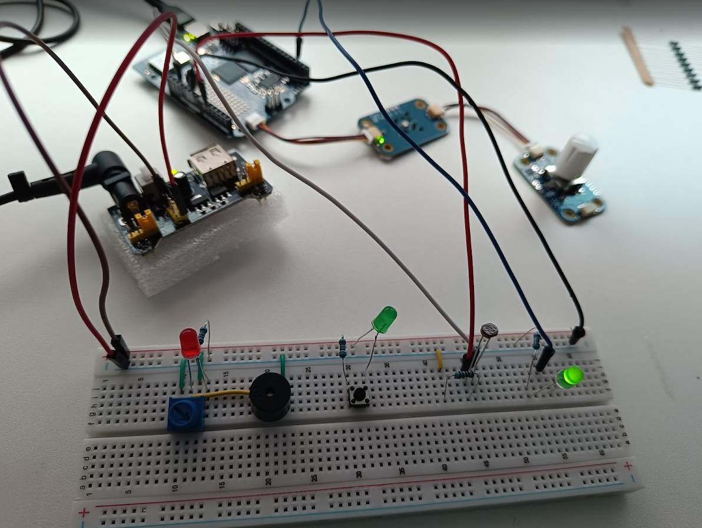

# First hyper-interactive Robot based on Google Robotics models/gemini-robotics-er-1.5-preview

## Early prototype - Arduino Uno Q, two weels with 360 degree movement, USB-C dongle (USB camera, USB speaker, mic), PowereBank 20000 mAh, Python 3.12, Google Gemini Robotics ER 1.5 Preview API

Use wheels to move, mic to listen, speaker to talk, camera to see. Make autonomous decisions. WiFi (API) connection required.