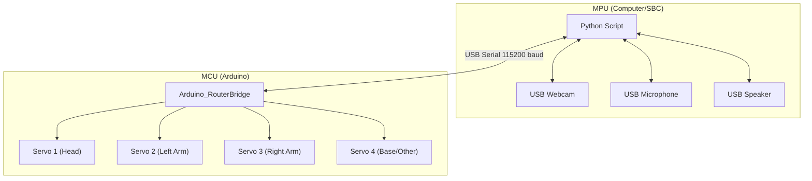

# Robot Hardware Schema

## Overview
The robot consists of an MCU (Arduino) handling motor control and an MPU (PC/SBC) handling high-level logic, vision, and audio. They are connected via USB (Serial).

## Connection Diagram

## Pinout Configuration

| Component | Arduino Pin | Description |
| :--- | :--- | :--- |
| **Servo 1** | D3 | Head Rotation (0-180°) |
| **Servo 2** | D5 | Left Arm (0-180°) |
| **Servo 3** | D6 | Right Arm (0-180°) |
| **Servo 4** | D9 | Base/Aux (0-180°) |
| **USB** | USB Port | Serial Communication with MPU |

## Power Distribution
- **Arduino**: Powered via USB or external 7-12V DC jack.
- **Servos**: **CRITICAL**: Do NOT power 4 servos directly from the Arduino 5V pin. Use an external 5V power supply (e.g., 4xAA battery pack or 5V/2A adapter) for the servos. Connect the external power ground to Arduino GND.

## MPU Requirements
- **OS**: Linux Debian
- **Python**: 3.12+
- **Ports**: 1x USB for Arduino, 1x USB for Webcam, 1x USB for Audio (or 3.5mm jacks).